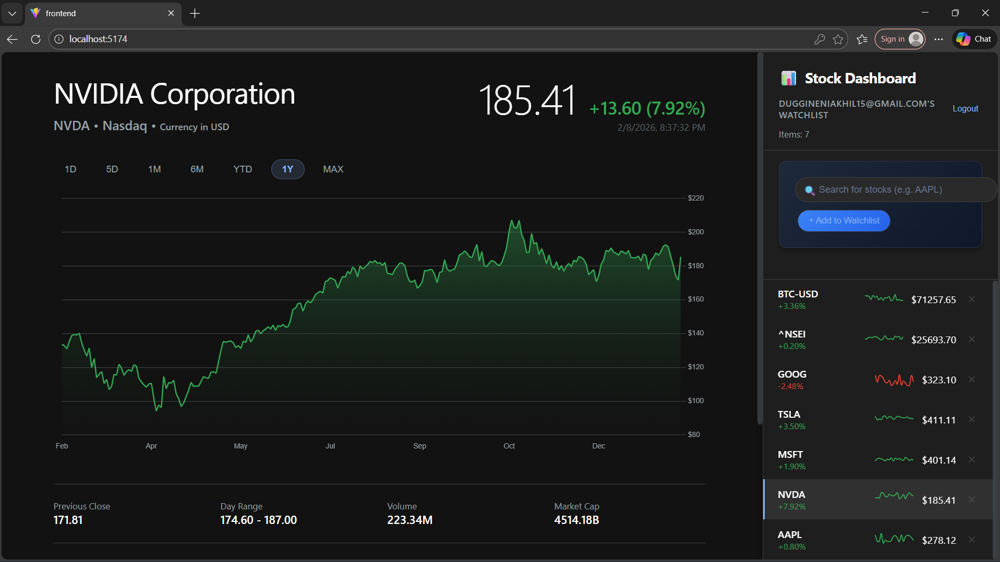
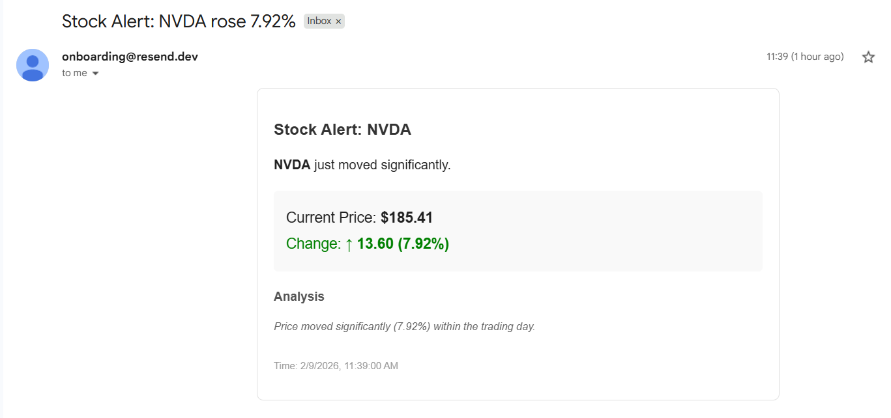
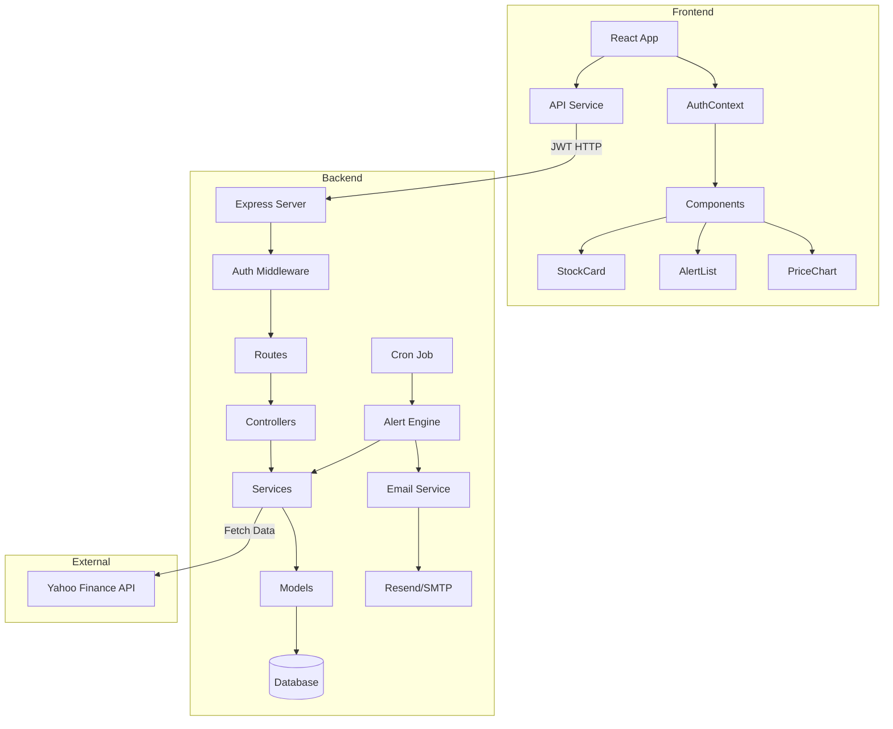

# Stock Dashboard Application

A modern, full-stack web application for tracking stock prices with intelligent alerts. Built with Node.js/Express backend and React frontend, featuring **User Authentication**, **Email Notifications**, real-time price monitoring, moving average analysis, and automated alert generation.


## ✨ Features

- **🔐 User Authentication** - Secure Signup and Login (JWT-based)
- **📧 Email & Internal Alerts** - Get notified via Email and in-app when stocks hit your targets
- **📊 Real-time Stock Tracking** - Monitor multiple stocks with live price updates
- **🔔 Intelligent Alerts** - Automated alerts for:
  - Price drops >5%
  - Moving average crossovers (20-day SMA)
- **📈 Interactive Charts** - 30-day price history with moving average overlay
- **💾 Persistent Storage** - Postgres/SQLite database for user profiles, watchlists, and alert history
- **🎨 Modern UI** - Dark theme with responsive design and smooth animations
- **⚡ Auto-refresh** - Updates every 30 seconds

## 📸 Screenshots


_Real-time Stock Dashboard with interactive charts_


_Automated Email Alerts for price movements_

## 🏗️ Architecture



## 🚀 Quick Start

### Prerequisites

- Node.js 18+ and npm
- Git

### Installation

1. **Clone the repository**
```bash
git clone <repository-url>
cd stock-tracker-agent-main
```

2. **Set up the backend**
```bash
cd backend
npm install
```

3. **Set up the frontend**
```bash
cd ../frontend
npm install
```

### Configuration

Create a `.env` file in the `backend/` directory with the following variables:

```env
PORT=5000
NODE_ENV=development
JWT_SECRET=your_super_secret_jwt_key

# Email Configuration (Resend/SMTP)
EMAIL_HOST=smtp.resend.com
EMAIL_PORT=465
EMAIL_SECURE=true
EMAIL_USER=resend
EMAIL_PASS=re_123456789
EMAIL_FROM=onboarding@resend.dev
```

### Running the Application

1. **Start the backend server** (Terminal 1)
```bash
cd backend
npm start
```
Server will run on `http://localhost:5000`

2. **Start the frontend dev server** (Terminal 2)
```bash
cd frontend
npm run dev
```
Frontend will run on `http://localhost:5173`

3. **Open your browser** and navigate to `http://localhost:5173`
   - Register a new account
   - Log in to start adding stocks to your watchlist

## 📁 Project Structure

```
stock-tracker-agent-main/
├── backend/
│   ├── server.js              # Express app entry point
│   ├── routes/                # API route definitions
│   │   ├── auth.js            # Authentication routes
│   │   ├── watchlist.js
│   │   ├── stock.js
│   │   └── alerts.js
│   ├── controllers/           # Request handlers
│   │   ├── authController.js
│   │   ├── watchlistController.js
│   │   ├── stockController.js
│   │   └── alertController.js
│   ├── services/              # Business logic
│   │   ├── stockService.js    # Yahoo Finance integration
│   │   ├── alertService.js    # Alert generation engine
│   │   ├── emailService.js    # Email notifications
│   │   └── alertEngine.js     # Scheduled job runner
│   ├── models/                # Database operations
│   │   ├── userModel.js
│   │   ├── watchlistModel.js
│   │   └── alertModel.js
│   ├── db/                    # Database files
│   │   ├── database.js        # DB connection
│   │   ├── schema.sql         # Table definitions
│   │   └── stocks.db          # SQLite database
│   └── package.json
│
├── frontend/ (Refer to frontend docs)
└── README.md
```

## 🔌 API Endpoints

### Authentication
| Method | Endpoint | Description |
|--------|----------|-------------|
| POST | `/api/auth/register` | Register new user |
| POST | `/api/auth/login` | Login and get JWT |

### Watchlist (Protected)
*Requires `Authorization: Bearer <token>` header*

| Method | Endpoint | Description |
|--------|----------|-------------|
| GET | `/api/watchlist` | Get user's watchlist |
| POST | `/api/watchlist` | Add stock to user's watchlist |
| DELETE | `/api/watchlist/:id` | Remove stock from watchlist |

### Stock Data
| Method | Endpoint | Description |
|--------|----------|-------------|
| GET | `/api/stock/:symbol` | Get current stock quote |
| GET | `/api/stock/:symbol/history?days=30` | Get historical price data |

### Alerts (Protected)
| Method | Endpoint | Description |
|--------|----------|-------------|
| GET | `/api/alerts` | Get user's alert history |

## 🎯 Alert Engine & Email Notifications

The alert engine runs automatically every hour (configurable in `server.js`) and checks for:

1. **Price Drop Alert**: Triggers when stock price drops >5% from previous close.
2. **Moving Average Crossover**: Triggers when price crosses or deviates significantly from 20-day SMA.

When an alert is triggered:
- An entry is saved to the `user_alerts` table.
- An **Email Notification** is sent to the registered user's email address.

## 🛠️ Technology Stack

- **Backend**: Node.js, Express, SQLite3, Axios, node-cron, Nodemailer
- **Frontend**: React, Vite, Chart.js, TailwindCSS (if applicable)
- **External APIs**: Yahoo Finance (No key required)

## 📊 Database Schema

### Users Table
```sql
CREATE TABLE users (
  id INTEGER PRIMARY KEY AUTOINCREMENT,
  email TEXT NOT NULL UNIQUE,
  password_hash TEXT NOT NULL,
  created_at DATETIME DEFAULT CURRENT_TIMESTAMP
);
```

### User Watchlist & Alerts
Linked to `users` table via `user_id`.

